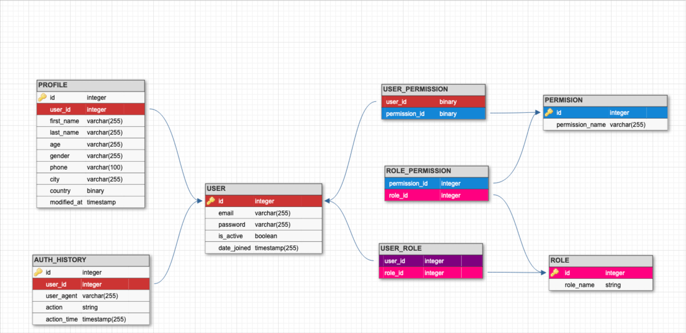

# Auth service team 1

## Схема БД:

Запуск проекта
> docker-compose up -d

Swagger документация API
> http://localhost/swagger-ui/

Миграции
> https://flask-migrate.readthedocs.io/en/latest/

Запуск контейнеров необходимых для разработки
> docker-compose -f docker-compose.dev.yml up -d 

Запуск тестов
> docker-compose -f docker-compose.tests.yml up --abort-on-container-exit tests
